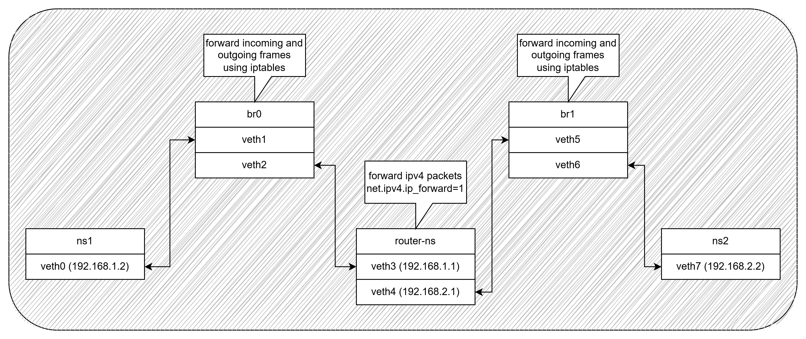

# Network Simulation Script (`netsim.sh`)

This repository contains a Bash script (`netsim.sh`) that simulates a simple network architecture using Linux namespaces, virtual Ethernet (veth) pairs, and bridges. The script sets up a network with two namespaces (`ns1` and `ns2`) connected via a router namespace (`router-ns`). It also configures IP addresses, routing, and forwarding rules to enable communication between the namespaces.

---

## Introduction

The `netsim.sh` script is designed to simulate a basic network architecture with the following features:
- **Namespaces**: Creates three network namespaces (`ns1`, `ns2`, and `router-ns`) to isolate network environments.
- **Bridges**: Sets up two bridges (`br0` and `br1`) to connect the namespaces.
- **Virtual Ethernet (veth) Pairs**: Creates veth pairs to connect namespaces to bridges.
- **IP Addressing**: Assigns IP addresses to the interfaces within the namespaces.
- **Routing**: Configures routing tables to enable communication between namespaces.
- **Forwarding**: Enables IP forwarding in the router namespace using kernel parameter and sets up `iptables` rules to allow traffic to and from bridges.
- **Connectivity Testing**: Tests connectivity between namespaces using `ping`.

---

## Network Architecture

The network architecture consists of three namespaces (`ns1`, `ns2`, and `router-ns`) connected via two bridges (`br0` and `br1`). Below are the diagrams illustrating the setup:



## IP Address Scheme

The following table summarizes the IP address assignments:

| Namespace   | Interface | IP Address       | Subnet Mask |
|-------------|-----------|------------------|-------------|
| `ns1`       | `veth0`   | `192.168.1.2`    | `/24`       |
| `router-ns` | `veth3`   | `192.168.1.1`    | `/24`       |
| `router-ns` | `veth4`   | `192.168.2.1`    | `/24`       |
| `ns2`       | `veth7`   | `192.168.2.2`    | `/24`       |

---

## Routing Configuration

The script configures routing tables in `ns1` and `ns2` to route traffic through `router-ns`. The following table summarizes the routing configuration:

| Namespace   | Destination      | Gateway/Interface|
|-------------|------------------|------------------|
| `ns1`       | `default`        | `192.168.1.1`    |
| `ns2`       | `default`        | `192.168.2.1`    |
| `router-ns` | `192.168.1.0/24` | `veth3`          |
| `router-ns` | `192.168.2.0/24` | `veth4`          |

---

## Simulation Test Procedure

The script includes a `ping_test` function to verify connectivity between the namespaces. The expected behavior is as follows:

| Test Case                     | Source      | Destination   | Expected Result |
|-------------------------------|-------------|---------------|-----------------|
| `ns1` to `ns2`                | `ns1`       | `192.168.2.2` | Successful ping (TTL received)         |
| `ns1` to `router-ns`          | `ns1`       | `192.168.1.1` | Successful ping (TTL received)         |
| `ns2` to `ns1`                | `ns2`       | `192.168.1.2` | Successful ping (TTL received)         |
| `ns2` to `router-ns`          | `ns2`       | `192.168.2.1` | Successful ping (TTL received)         |
| `router-ns` to `ns1`          | `router-ns` | `192.168.1.2` | Successful ping (TTL received)         |
| `router-ns` to `ns2`          | `router-ns` | `192.168.2.2` | Successful ping (TTL received)         |

---

## Script Behavior

The script is organized into functions for modularity and error handling. It behaves as follows:
- **Success**: If all steps complete successfully, the script displays a final network configuration diagram and runs connectivity tests.
- **Failure**: If any step fails, the script triggers the `cleanup` function to remove all configurations and exits with an error message.
- **Interrupted**: If the script is interrupted (e.g., via `Ctrl+C`), it gracefully cleans up the network setup.

---

## How to Run Simulation

### 1. Clone repository
```bash
git clone https://github.com/mtrp12/network-simulation-1.git
```

### 2. Move into the directory
```bash
cd network-simulation-1
```

### 3. Make the Script Executable
```bash
chmod +x netsim.sh
```

### 4. Run the Script
```bash
./netsim.sh
```

### 5. Clear Configuration (Optional)
To clean up the network setup, run:
```bash
./netsim.sh clean
```

